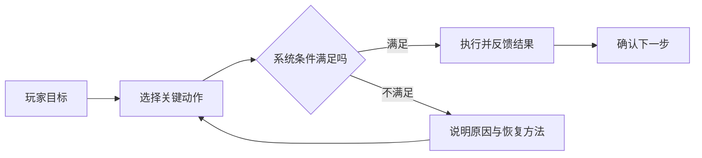

## 从结果开始，而不是从页面开始

做交互流程时，我更愿意先写下玩家最终想完成的事情，再回推界面需要提供的动作、信息与反馈。这样可以避免流程图沦为页面之间的连线，也能更早发现“界面存在，但玩家没有理由使用”的步骤。

:::image
src: /assets/notes/interaction-flow-review/player-goal-flow.webp
alt: 从玩家目标回推决策、反馈与异常路径的手绘流程示意
caption: 先定义玩家目标，再拆解关键决策、系统反馈和失败后的恢复路径。
layout: wide
:::

## 一条流程至少要回答四个问题

| 检查项 | 需要回答的问题      | 常见遗漏        |
| --- | ------------ | ----------- |
| 目标  | 玩家为什么进入这个功能？ | 只描述页面，不描述意图 |
| 信息  | 做决定前需要知道什么？  | 重要信息出现得太晚   |
| 反馈  | 输入后系统发生了什么？  | 等待与不可用状态不明确 |
| 恢复  | 失败后怎样继续？     | 只有报错，没有下一步  |

1. **目标是什么？** 玩家进入这个功能时想完成什么，而不是产品希望他看见什么。
2. **做决定需要什么信息？** 信息应在决定之前出现，并与当前动作保持空间上的关联。
3. **系统如何回应？** 每个有效输入都要有可感知的状态变化，尤其是等待、失败和不可用状态。
4. **出错后怎么回来？** 异常路径不应该只是一个报错弹窗，还要告诉玩家下一步能做什么。

> 正常路径说明功能如何工作；异常路径决定玩家是否信任这个功能。

## 用最小闭环检查设计

我通常把第一版流程压缩成“意图—动作—反馈—下一步”四个节点。如果其中任何一段需要依赖说明文字才能理解，就回到信息层级或控件状态继续修改。确认最小闭环后，再加入分支、权限、资源不足与中断恢复等边界情况。

最后再把流程映射回页面：每个页面只承担清晰的任务，每次跳转都有理由，每个状态都能被玩家识别。这样产出的流程图不仅是交付物，也会成为原型、文案和测试用例共享的结构。
