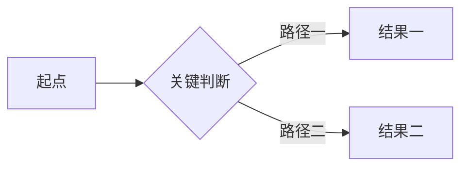

用一段文字概括笔记内容。

## 小节标题

正文内容。

:::columns
ratio: 1:2
:::column
### 观察

左侧内容。
:::
:::column
### 分析

右侧内容；窄屏会自动切换为单列。
:::
:::

| 观察项 | 现象 | 结论 |
| --- | --- | --- |
| 示例 | 示例内容 | 示例结论 |

:::drawing
src: /assets/notes/example-note/task-flow.svg
dark_src: /assets/notes/example-note/task-flow.dark.svg
alt: 可视化编辑的任务流程图
caption: 源文件为 task-flow.excalidraw.md，保存时自动导出 SVG。
layout: wide
:::

:::video_embed
src: https://www.youtube.com/watch?v=VIDEO_ID
title: 笔记视频演示
caption: 可以在中英文文档中分别填写不同视频地址和说明。
layout: wide
:::
